# Hyperliquid workflows for fintool CLI

The scripts calls the `fintool` CLI to perform common tasks on Hyperliquid and Unit.
The `tests/show_status.sh` script can be called at anytime to review the current status
of your Hyperliquid account. The script calls the following three commands and aggregate the 
results in a human readable format.

## Deposit USDC from Base to Hyperliquid

### Run the script

```
tests/deposit.sh
```

1 Deposit (bridge) USDC from Base to Hyperliquid

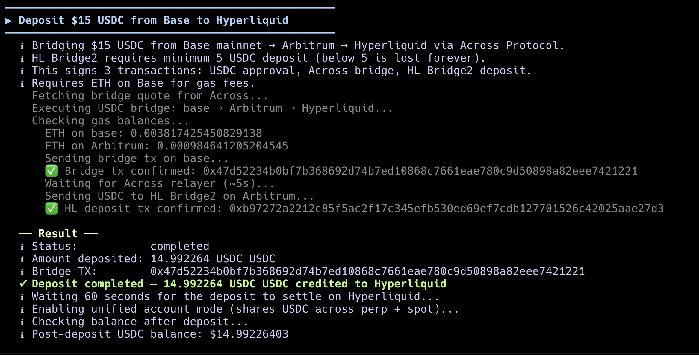

2 The balance and status of a unified account. It has about $30 USDC.


### Step by step

Here we start from the assumption that we have NOT setup anything on Hyperliquid. We do have USDC and a little ETH (for gas) on the Base mainnet. We have configured the wallet in `~/.fintool/config.toml` for our Base account.

The command below bridges $15 USDC from Base to Hyperliquid. 
**IMPORTANT: You must bridge more than $5 USDC.**
Your address on Hyperliquid is the SAME as your Base address.  
In the process, it will need to first bridge from Base to Arbitrum, and then from Arbitrum to Hyperliquid. 
The  `fintool` command automatically takes care of the bridging, including sending gas from Base to Arbitrum and Hyperliquid as needed, as well as constructing, signing, submitting and settling all the bridging transactions.

```
fintool deposit USDC --amount 15 --from base
```

> The command has a `--from base` but no destination `--exchange` since it defaults to Hyperliquid.

The deposited USDC goes into Hyperliquid perp margin account. We would like to use it for spot trading as well.
So, we use the `fintool` command to set the account to be unified across perp and spot.

```
fintool perp set-mode unified
```

After the Hyperliquid address is funded, you should be able to check its status.

```
fintool balance
```

## Trade HYPE spot

### Run the script

```
tests/buy_hype.sh
```

1 Account balance before the buy - $30 USDC

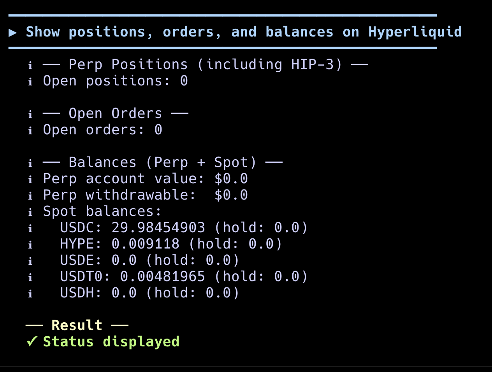

2 Buy $12 worth of HYPE tokens on the spot market

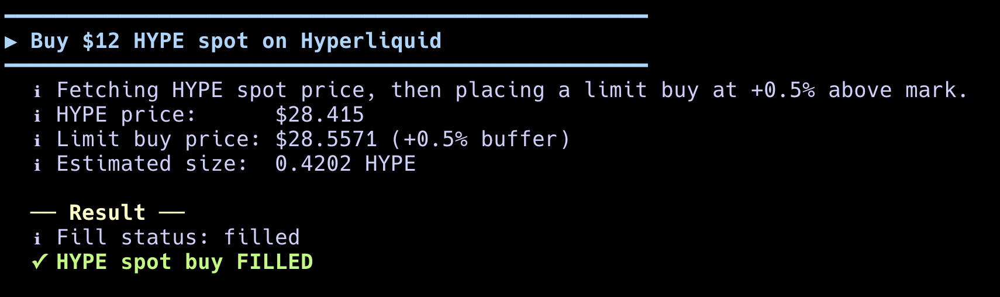

3 Account balance after the buy. About $18 USDC and $12 worth of HYPE.


```
tests/sell_hype.sh
```

4 Sell all the HYPE tokens in this account on the spot market

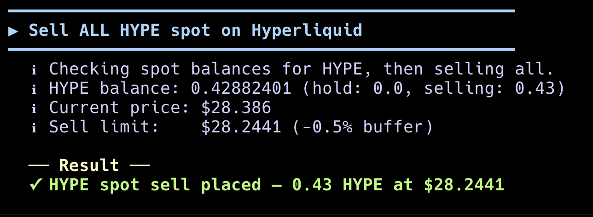

5 Account balance after the sell. About $30 USDC and dust amount of HYPE (rounding error).


### Step by step

First, get the current price of HYPE.

```
fintool quote HYPE
```

Put in an order for HYPE at a max price. In this command, we order $12 worth of HYPE at the mac price of $25/HYPE.

```
fintool order buy HYPE 12 25.00
```

You can check the balance of USDC and HYPE in your account once the order is filled.

```
fintool balance
```

Once the HYPE price goes up, you can put in another order to sell HYPE. The command below sells 0.48 HYPE at $30/HYPE.

```
fintool order sell HYPE 0.48 30.00
```

Check the balance again.

```
fintool balance
```

## Trade ETH perp

### Run the script

```
tests/buy_eth.sh
```

1 Account balance before the buy - $30 USDC

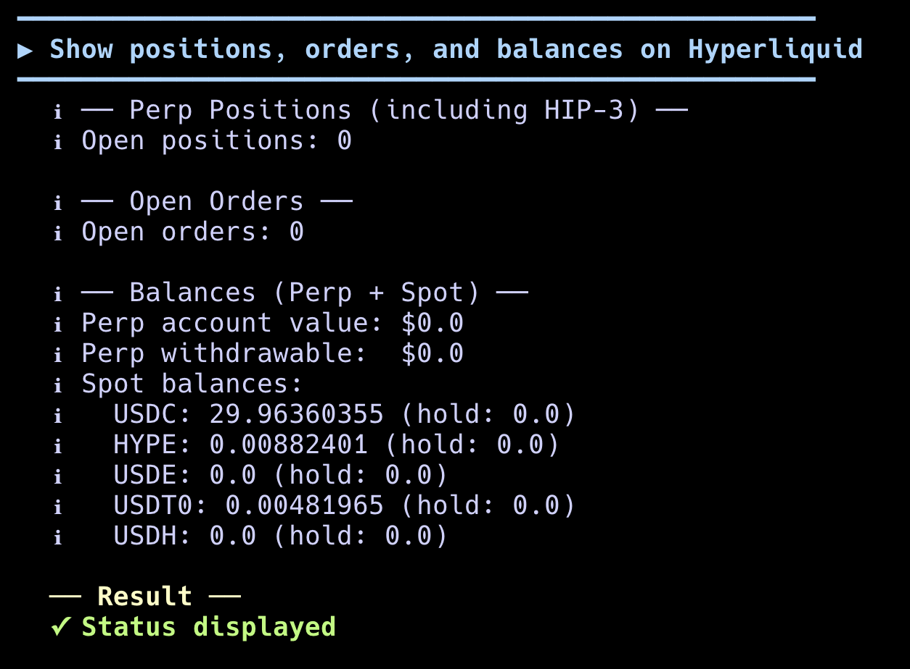

2 Buy $12 worth of ETH perp at 2x leverage

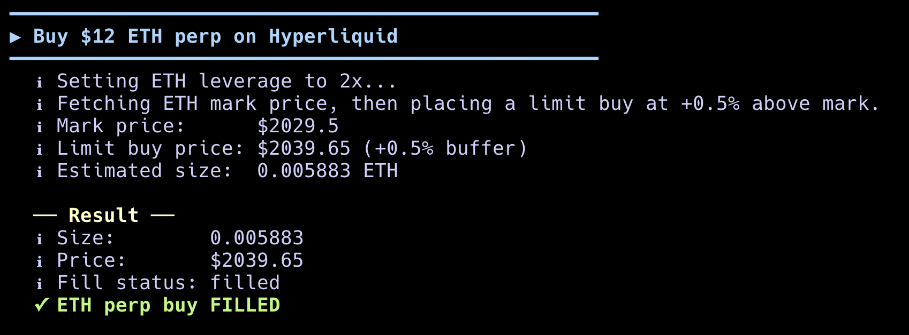

3 Account balance after the buy. An ETH perp contract, about $30 USDC in the margin account but $6 is locked (for 2x leverage of $12).

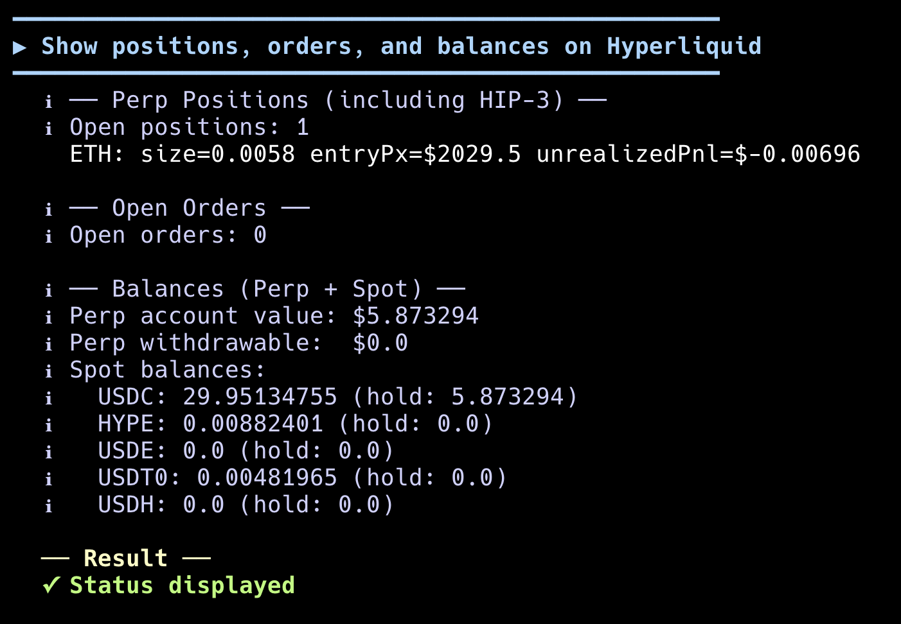

```
tests/sell_eth.sh
```

4 Close the ETH perp contract in this account

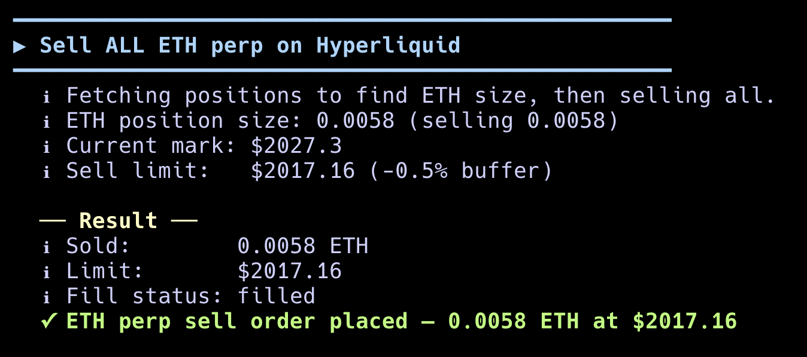

5 Account balance after the sell. About $30 USDC.

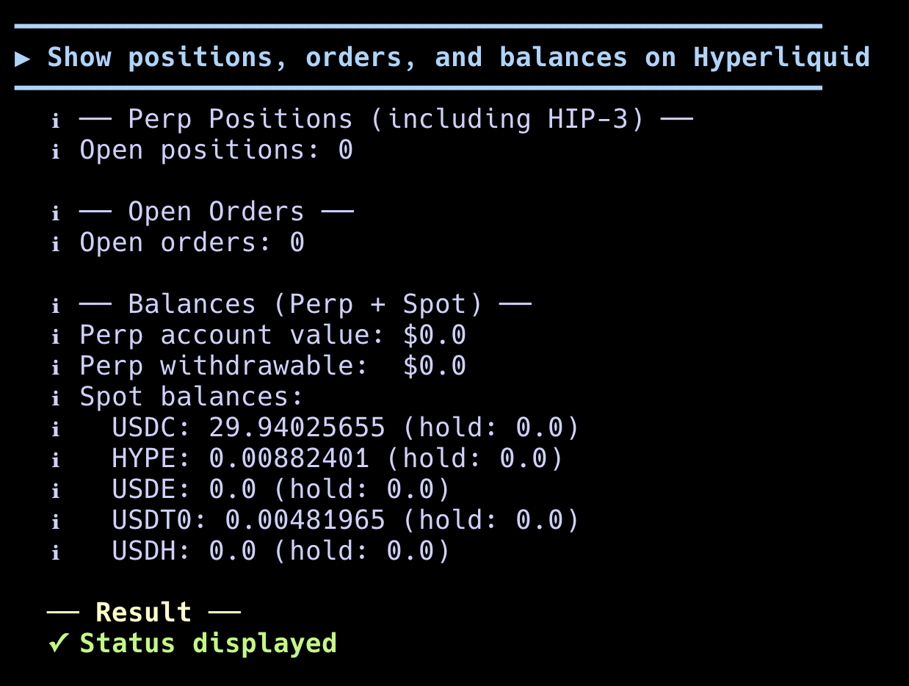


### Step by step

First, get the current price of ETH.

```
fintool perp quote ETH
```

Set the perp leverage to 2x (max is 20x)

```
fintool perp leverage ETH 2
```

Buy $12 of ETH perp at a limit price (adjust price to current market)

```
fintool perp buy ETH 12 2100.00
```

Check out the perp positions, open orders, and USDC balance

```
fintool positions
fintool orders
fintool balance
```

Once the ETH price goes up. We go the opposite direction to close the perp position.
Sell to close the position (adjust size and price to your position).
The `--close` flag means that instead of opening up a new short (sell) perp position, we should reduce the size of the existing long (buy) position by the specified amount.

```
fintool perp sell ETH 0.006 2150.00 --close
```

Check out the perp positions, open orders, and USDC balance to ensure that the long position is closed and the USDC are back in the account unlocked.

```
fintool positions
fintool orders
fintool balance
```

## Trade commodity perp

### Run the script

```
tests/buy_silver.sh
```

1 Account balance before the buy - $30 USDC


2 Buy $12 worth of Silver perp at 2x leverage


3 Account balance after the buy. A Silver perp contract, about $30 USDT0 (see below why it is NOT USDC) in the margin account but $6 is locked (for 2x leverage of $12).

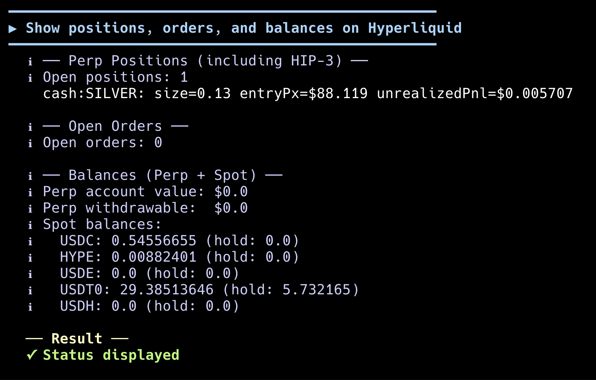

```
tests/sell_hip3.sh
```

4 Close the Silver perp contract in this account

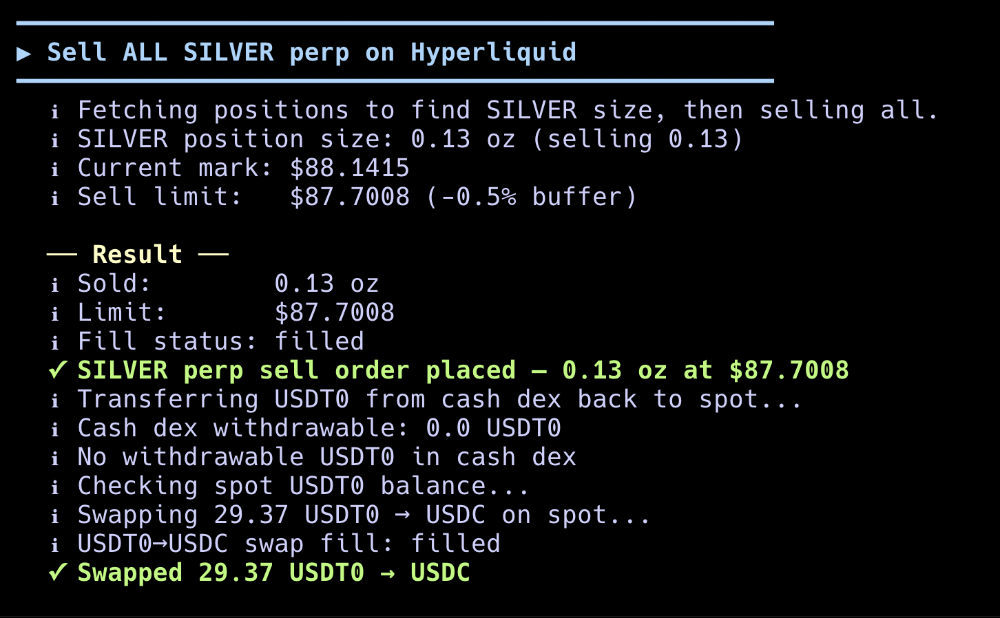

5 Account balance after the sell. About $30 USDC.


### Step by step

On Hyperliquid, the commodity perp market is actually separate from the main perp market. THe commodity market
is called HIP-3 and are made by operators like Unit. As a result, the HIP-3 perp market does not use the
"unified" USDC on Hyperliquid as margin for perp contracts. You will first convert your USDC
to USDT0, which is a special stable coin for the HIP-3 market. You can buy USDT0 using USDC on the spot market.
It is to buy $30 USDT0 at $1.002 USDC/USDT0.

```
fintool order buy USDT0 30 1.002
```

Next, transfer the $20 USDT0 to the HIP-3 market.

```
fintool transfer 30 to-dex --dex cash
```

Now you can trade commodity assets on the HIP-3 market. We will trade SILVER. Get the current price of SILVER.

```
fintool perp quote SILVER
```

Set the perp leverage to 2x (max is 20x)

```
fintool perp leverage SILVER 2
```

Buy $12 of SILVER perp at a limit price (adjust price to current market)

```
fintool perp buy SILVER 12 89.00
```

Check out the perp positions, open orders, and USDC  / USDT0 balance. SILVER shows as "cash:SILVER".

```
fintool positions
fintool orders
fintool balance
```

Once the SILVER price goes up. We go the opposite direction to close the perp position.
Sell to close the position (adjust size and price to your position).
The `--close` flag means that instead of opening up a new short (sell) perp position, we should reduce the size of the existing long (buy) position by the specified amount.

```
fintool perp sell SILVER 0.14 91.00 --close
```

Transfer the $30 USDT0 back to spot.

```
fintool transfer 30 from-dex --dex cash
```

Swap $30 USDT0 back to USDC at 0.998 USDC/USDT0.

```
fintool order sell USDT0 30 0.998
```

Check out the perp positions, open orders, and USDC balance to ensure that the long position is closed and the USDC are back in the account unlocked.

```
fintool positions
fintool orders
fintool balance
```

## Withdraw USDC back to Base

### Run the script

```
tests/withdraw.sh 30
```

1 Account balance before the withdraw - $30 USDC

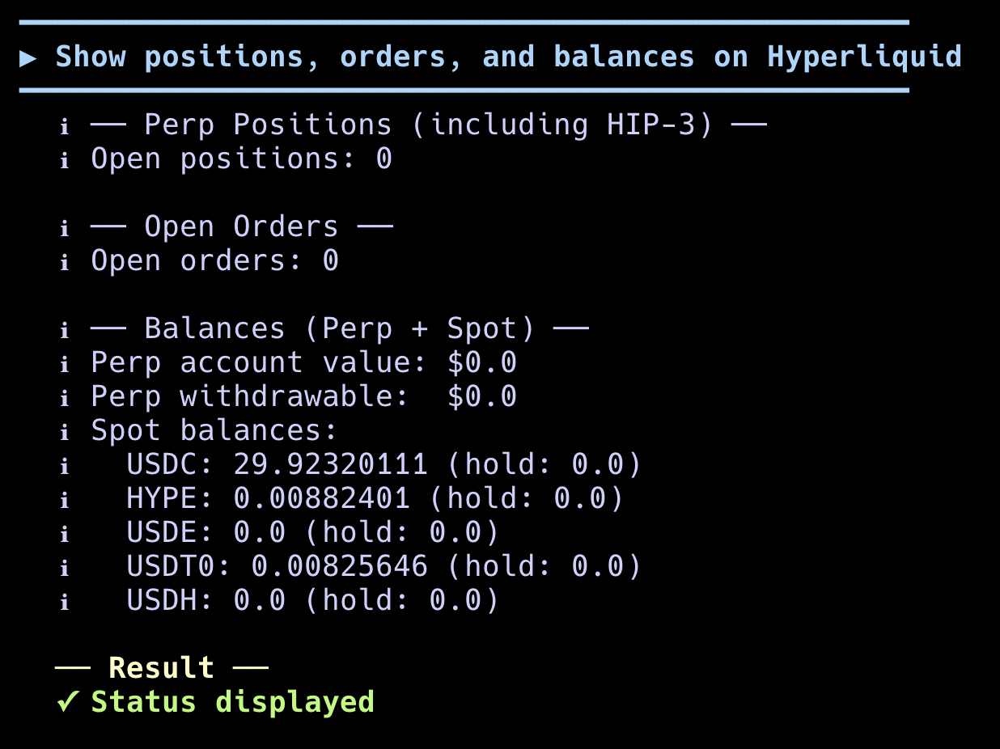

2 Withdraw specified amount of USDC

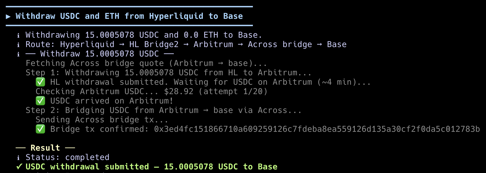

3 Account balance after the withdraw.

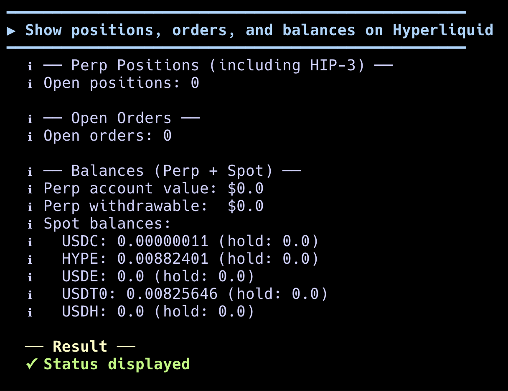

### Step by step

The withdraw command reversed the bridges in the deposit command to send the USDC back from Hyperliquid to Arbitrum and then to Base.
The command below bridges $10 USDC back to the Base address.

```
fintool withdraw 10 USDC --network base
```

